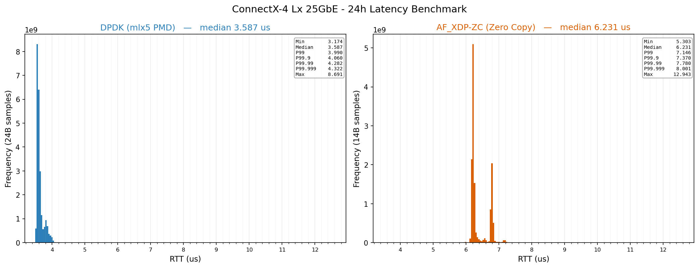

# ABTRDA3 — one C++20 API for DPDK, AF_XDP and PACKET_MMAP

**Kernel-bypass networking in C++ without the boilerplate.** Write your packet loop once
against four lines of API, then pick DPDK, AF_XDP, or `PACKET_MMAP` from a config file —
no code change, no recompile.

This project was inspired by CERN's Controls Middleware which uses a system called Remote Device Access(RDA). Since I worked in 
CERN's Accelerator Beams Transfer Group, I named it ABT + RDA3 -> ABTRDA3. 



*Same NIC, same host, same application code — only the `transport` line in the TOML
changed. One frame in flight, 64-byte frames, RTT measured with `rdtscp` on an isolated
core. **DPDK: 3.587 µs median** over 23.3 B packets. **AF_XDP zero-copy: 6.231 µs median**
over 13.5 B packets. Zero loss in both.*

The full campaign — verbs, DPDK, AF_XDP, DPDK-over-AF_XDP across ConnectX-4 Lx (25G),
XXV710-DA2 (25G) and I225-V (2.5G copper), with tail percentiles out to P99.999 — is in
**[docs/Benchmarks.md](docs/Benchmarks.md)**. The driver bugs we hit on the way (and how
we proved them) are in **[docs/Known_driver_issues.md](docs/Known_driver_issues.md)**.

---

## Why this exists

Kernel bypass is not hard because the *concepts* are hard. It's hard because every stack
has a different, sprawling setup ritual: DPDK wants EAL init, hugepages, a vfio-pci bind,
mempools, ethdev queue config and PMD devargs. AF_XDP wants a UMEM, four rings, an XSK
socket, an XDP program, queue steering and busy-poll socket options. `PACKET_MMAP` wants
`TPACKET_V2` ring geometry and a fanout policy. Getting *any* of them merely working is a
week; getting them **fast** is where the real traps live, and none of that knowledge
transfers between them.

ABTRDA3 does the ritual for you and hands back one interface:

```
                      ┌────────────────────────────────────────────┐
   your packet loop ──│  acquire / commit  +  tryReceive / release  │
                      └────────────────────┬───────────────────────┘
                                           │  C++20 concepts, all inlined
              ┌────────────────┬───────────┴────────┬────────────────┐
            DPDK             AF_XDP            PACKET_MMAP         verbs
      (i40e/igc/mlx5)     (zero-copy)           (no deps)      (RAW_PACKET QP)
```

- **Zero-cost.** The transport is a template parameter, not a virtual base. Every hot-path
  call inlines straight down to `rte_eth_rx_burst` / `xsk_ring_cons__peek`. There is no
  vtable, no type erasure and no allocation on the data path.
- **The fast configuration is the default.** Busy-poll, zero-copy, NAPI deferral, the
  correct TX-kick policy, interrupt-throttle registers, queue steering — all set and, more
  importantly, **verified by reading the state back from the kernel** and printed at
  startup. If you didn't get zero-copy, it tells you.
- **Honest measurement built in.** An `rdtscp`-timed RTT client and a HdrHistogram
  recorder that survives billion-sample soaks in ~1.5 MB of RAM.

## Build

```bash
cmake -B build/x86_64-release -G Ninja \
  -DCMAKE_TOOLCHAIN_FILE=cmake/toolchain-x86_64.cmake \
  -DCMAKE_BUILD_TYPE=Release
cmake --build build/x86_64-release
```

Dependencies (found via `pkg-config`): **libdpdk** (25.11 LTS), **libxdp** + **libbpf**,
and **libibverbs**/**libmlx5** for the verbs backend. C++20 compiler (GCC 13+), and
`intel_iommu=on iommu=pt` on the kernel command line for the DPDK vfio path.

## The API — four calls

Both concepts are ~5 lines of code (`src/backends/common/RingConcepts.hpp`). Anything that
satisfies them works with every app in this repo:

```cpp
template <typename T>
concept TxRing = requires(T t, std::span<const std::uint8_t> frame, std::uint32_t len) {
  { t.acquire(len) } noexcept -> std::same_as<std::uint8_t*>;  // borrow a TX buffer
  { t.commit()    } noexcept;                                  // hand it to the NIC
  { t.send(frame) } noexcept -> std::same_as<bool>;            // acquire+copy+commit
  { t.prefillRing(frame) } noexcept;                           // stamp a header template
};

template <typename T>
concept RxRing = requires(T t) {
  { t.tryReceive() } noexcept -> std::same_as<RxFrame>;        // peek, no copy
  { t.release()    } noexcept;                                 // give the buffer back
};
```

### 1. Construct + init — the only place the transports differ

```cpp
// DPDK — any PMD (i40e / igc / mlx5). Binds vfio-pci, inits EAL, sets up mempool + queues.
DPDK<DpdkMode::RxTx> nic("xxv0", /*lcore=*/5, /*driver=*/"i40e");
if (!nic.init()) return 1;

// AF_XDP — zero-copy + busy-poll. Loads the XDP program, builds the UMEM + 4 rings,
// steers the queue, applies the NAPI regime, then reads back what the kernel granted.
AFXDP<AFXDPMode::RxTx> xsk("xxv0", /*queue=*/0);
if (!xsk.init(/*deferral=*/false, /*irqSuspend=*/false)) return 1;

// PACKET_MMAP — no dependencies, no root-only rebinding, works on any NIC.
RingConfig cfg{ .interface = "eno1", .direction = RingDirection::RX, .protocol = 0x88B5 };
PacketMmapRx rx(cfg);
```

### 2. Then the loop is identical, whichever you chose

```cpp
// Transmit — acquire a buffer straight in the ring, write in place, commit. No copy.
if (std::uint8_t* buf = tx.acquire(64)) {
    std::memcpy(buf + 14, payload, 50);      // header was pre-stamped by prefillRing()
    tx.commit();                             // rings the doorbell
}

// Receive — peek the frame where the NIC DMA'd it, then release the buffer.
if (RxFrame f = rx.tryReceive(); !f.data.empty()) {
    handle(f.data);                          // std::span<const std::uint8_t>
    rx.release();
}
```

Because the loop is generic over the concepts, you write it **once** — this is the actual
shape of the `--server` reflector, minus the shutdown handling:

```cpp
template<TxRing Tx, RxRing Rx>
void reflect(Tx& tx, Rx& rx, std::uint32_t frameSize, std::stop_token stop) {
    while (!stop.stop_requested()) {
        RxFrame rxf = rx.tryReceive();
        if (rxf.data.empty()) continue;                        // busy-poll, no syscall

        std::uint8_t* dst = tx.acquire(frameSize);             // slot in the TX ring
        std::memcpy(dst,      &rxf.data[6],  6);               // dst MAC = RX src
        std::memcpy(dst + 6,  &rxf.data[0],  6);               // src MAC = RX dst
        std::memcpy(dst + 12, &rxf.data[12], frameSize - 12);  // rest of the frame

        rx.release();                                          // free the RX slot
        tx.commit();                                           // ring the doorbell
    }
}
```

One copy, RX ring straight into the TX ring — no intermediate buffer, no allocation, no
syscall. And it compiles unchanged against `DPDK<RxTx>`, `AFXDP<RxTx>`, `PacketMmapTx` +
`PacketMmapRx`, and `Verbs<RxTx>`.

## Sample applications

One binary, one config file, four modes:

```bash
# Traffic generator — flood N frames from the [client] port
sudo ./abtrda3_test --txgen --count 1000000 --config abtrda3_test.toml

# Packet sink — receive + validate on the [server] port, report loss
sudo ./abtrda3_test --rxsink --config abtrda3_test.toml

# RTT: reflector on one host/port ...
sudo ./abtrda3_test --server --config abtrda3_test.toml
# ... originator on the other. Sends, spins for the echo, records the rdtscp delta.
sudo ./abtrda3_test --client --config abtrda3_test.toml
```

`--client` runs for `duration_sec` with **one frame in flight** (send → busy-poll for the
matching echo → record), which is what makes the number a *latency* measurement rather
than a throughput one. Samples go over an SPSC queue to a histogram thread on its own
isolated core, so recording never touches the hot path. On exit you get:

```
=== Round-Trip Latency Results (1645735 samples) ===
Min:     12.630 us      P99.9:   13.886 us
Median:  13.388 us      P99.99:  13.953 us
P99:     13.798 us      P99.999: 14.022 us
Max:     14.080 us      Mean:    13.427 us
-- one-way estimate (RTT/2) --
Median 1-way: 6.694 us
```

plus a percentile CSV and a per-bucket histogram CSV, ready for
`test/latency_analysis/plot_latency_hist.py` (single run) or `plot_latency_compare.py`
(the side-by-side above).

## Configuration — TOML, not 30 CLI flags

Kernel-bypass benchmarks have a lot of knobs, and burying them in command-line arguments
makes runs impossible to reproduce six months later. Everything lives in one file you can
commit next to the results:

```toml
[general]
ether_type       = 0x88B5
frame_size       = 64          # >= 26 (14B eth hdr + 4B seq + 8B TSC stamp)
send_interval_us = 0           # 0 = back-to-back, 1000 = 1 ms paced
output           = "rtt.csv"   # writes rtt.csv + rtt.hist.csv

# Tx port — used by --client and --txgen
[client]
transport       = "dpdk"       # "dpdk" | "af_xdp" | "packet_mmap" | "verbs"
interface       = "xxv0"
driver          = "i40e"       # the port's kernel driver (DPDK only)
mac             = "40:a6:b7:02:b3:10"
cpu_core        = 5            # the busy-poll core (isolate it: isolcpus=...)
duration_sec    = 60           # 60 = smoke test, 86400 = 24 h soak
recorder_core   = 7            # histogram thread — must differ from cpu_core
dpdk_bifurcated = false        # true for mlx5 (keep the kernel driver, no vfio unbind)
dpdk_afxdp_pmd  = false        # true to run DPDK *over* an AF_XDP socket

# Rx port — used by --server and --rxsink
[server]
transport = "dpdk"
interface = "xxv1"
driver    = "i40e"
mac       = "40:a6:b7:02:b3:11"
cpu_core  = 6

[af_xdp]                       # only read when transport = "af_xdp"
enable_deferral    = false     # napi_defer_hard_irqs + gro_flush_timeout
enable_irq_suspend = false     # kernel 6.13+ irq-suspend-timeout regime
```

**Switching transport is one word.** Change `transport = "dpdk"` to `"af_xdp"` on both
roles and re-run — same binary, same loop, same measurement methodology. That is what
makes the comparison at the top of this page an apples-to-apples one, and it's the whole
point of the library.

The two roles are independent, so you can also pair *different* transports across a link
(a DPDK originator against a `PACKET_MMAP` reflector, for instance) to isolate which side
of the wire a cost lives on.

## Supported hardware

| Transport | Backend | Notes |
|---|---|---|
| `dpdk` | i40e (XXV710), igc (I225-V), mlx5 (ConnectX-4 Lx) | Lowest latency. vfio-pci pass-through, or bifurcated for mlx5 |
| `af_xdp` | Any driver with native XDP + zero-copy | Kernel stays in the datapath; i40e needs a [one-line busy-poll patch](docs/Known_driver_issues.md) |
| `packet_mmap` | AF_PACKET / `TPACKET_V2` | No dependencies, no rebinding — the portable baseline |
| `verbs` | mlx5 RAW_PACKET QP | The sub-2 µs reference point (2.426 µs RTT) |
| `intel_i210` | Custom poll-mode driver | Bare-metal register PMD built directly on ABTEdge MMIO + DMA — no vendor SDK underneath |

## Test bench

All published numbers come from one machine: Intel i9-11900K (SMT off, C-states off, fixed
5.0 GHz), Ubuntu 26.04, custom `CONFIG_HZ=100` kernel with `nohz_full` + `isolcpus` on the
poll cores and every device IRQ steered off them. The two ports of each NIC are cabled
back to back, so a frame's whole journey is silicon and wire — no switch in the path.
Methodology, kernel command line and BIOS settings: [docs/Benchmarks.md](docs/Benchmarks.md) §2.

## License

ABTRDA3 is licensed under the [Apache License 2.0](LICENSE) (SPDX: `Apache-2.0`).
Every first-party source file carries an SPDX identifier.

**GPL-2.0 exceptions.** Three files interact with the Linux kernel and are licensed
GPL-2.0, marked by their own SPDX headers:

| File | Why GPL |
|---|---|
| `src/backends/AF_XDP/af_xdp_kern.c` | XDP/BPF program, loaded into the kernel at runtime |
| `src/backends/bpf/xdp_filter.bpf.c` | XDP/BPF EtherType filter, same runtime-load model |
| `patches/i40e-afxdp-busypoll.patch` | Patch against the GPL-2.0 in-kernel `i40e` driver |

The BPF programs are compiled to standalone `.o` objects and loaded into the kernel at
runtime — they are never linked into the Apache-2.0 binary. This is the same
userspace/BPF license split used by Cilium and the other major XDP projects. The `i40e`
patch modifies the kernel itself, so it can only ever be GPL-2.0.

**Dependencies** are fetched at configure time or system-installed, never vendored:
[ABTEdge](https://github.com/ASherjil/ABTEdge) (Apache-2.0), {fmt} (MIT),
toml++ (MIT), rigtorp/SPSCQueue (MIT), HdrHistogram_c (BSD-2-Clause + CC0),
libbpf and libxdp (LGPL-2.1 OR BSD-2-Clause), DPDK (BSD-3-Clause), rdma-core /
libibverbs (GPL-2.0 OR Linux-OpenIB), and Onload's userspace `libciul` (BSD-2-Clause).
