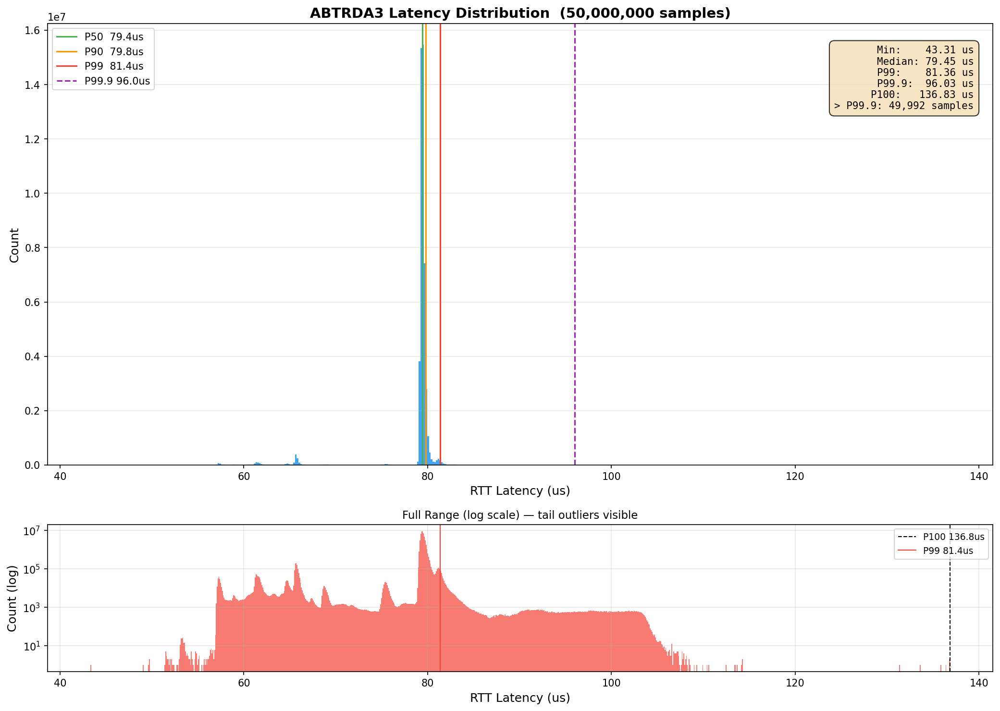

# Accelerator Beam Transfer Remote Device Access 3 (ABTRDA3)

Ultra-low-latency Ethernet timing library with four transport backends.
Sub-25 µs round-trip on stock hardware with a custom poll-mode driver.



## Quick start

```bash
# Build
cmake -B build/x86_64-release -G Ninja \
  -DCMAKE_TOOLCHAIN_FILE=cmake/toolchain-x86_64.cmake \
  -DCMAKE_BUILD_TYPE=Release
cmake --build build/x86_64-release
```

**Config** — edit `test/abtrda3_test.toml`:

```toml
[general]
ether_type       = 0x88B5
frame_size       = 64
watchdog_sec     = 30
send_interval_us = 0            # 0 = line rate, 1000 = 1 ms paced

[server]
transport = "packet_mmap"       # or af_xdp, intel_i210, cadence_gem
interface = "eno2"
mac       = "d4:f5:27:2a:a9:59"
cpu_core  = 4

[client]
transport = "packet_mmap"
interface = "eno2"
mac       = "20:87:56:b6:33:67"
cpu_core  = 4
count     = 1000
```

**Run** — same binary, four modes:

```bash
# Ping-pong server (reflector)
sudo ./abtrda3_test --server --config abtrda3_test.toml

# Ping-pong client (measures RTT in µs)
sudo ./abtrda3_test --client --count 1000 --config abtrda3_test.toml

# Traffic generator (unidirectional TX)
sudo ./abtrda3_test --txgen --count 1000000 --config abtrda3_test.toml

# Packet sink (unidirectional RX, validates dst MAC)
sudo ./abtrda3_test --rxsink --config abtrda3_test.toml
```

Server and client pick their transport independently — pair an x86_64 Intel I210
with an ARM64 Cadence GEM, or two AF_XDP sockets on the same machine.

## Transports

| Transport | Backend | Platforms | Notes |
|-----------|---------|-----------|-------|
| `packet_mmap` | AF_PACKET + `TPACKET_V2` rings | Any | Zero-dependency baseline, ~30 µs RTT |
| `af_xdp` | AF_XDP + XDP redirect | Linux 5.4+ | Higher throughput, needs BPF |
| `intel_i210` | Custom PMD (unbinds `igb`) | x86_64, I210 only | Sub-25 µs RTT, hardware timestamping |
| `cadence_gem` | Custom PMD (unbinds `macb`) | ARM64, Zynq UltraScale+ | The only PMD for this hardware — no DPDK driver exists. Built-in TAP bridge keeps SSH/NFS alive while the driver is unbound. |

Cadence GEM requires a one-time `insmod` of the `gem_uio.ko` kernel module
(provided under `src/Cadence_GEM/gem_uio/`) for coherent DMA descriptor rings.

## Build options

```bash
# With AF_XDP (needs clang + libelf + zlib, libbpf fetched automatically)
cmake -B build/x86_64-release -G Ninja \
  -DCMAKE_TOOLCHAIN_FILE=cmake/toolchain-x86_64.cmake \
  -DCMAKE_BUILD_TYPE=Release \
  -DABTRDA3_ENABLE_AF_XDP=ON

# ARM64 cross-compile (FECOS sysroot)
cmake -B build/arm64-release -G Ninja \
  -DCMAKE_TOOLCHAIN_FILE=cmake/toolchain-aarch64.cmake \
  -DCMAKE_BUILD_TYPE=Release
```

## TOML reference

Each role specifies its own transport, interface, driver, MAC, and CPU core.
Transports that unbind a kernel driver (`intel_i210`, `cadence_gem`) require
the `driver` field. The `mac` is the **destination** MAC for that role.

```toml
[general]         # global settings
[server]          # --server / --rxsink role
[client]          # --client / --txgen role
[packet_mmap]     # block_size, block_number (if using packet_mmap)
[af_xdp]          # umem_frame_size, frame_count, need_wakeup (if using AF_XDP)
```

No recompilation to switch transports — same binary, different `transport` value.
