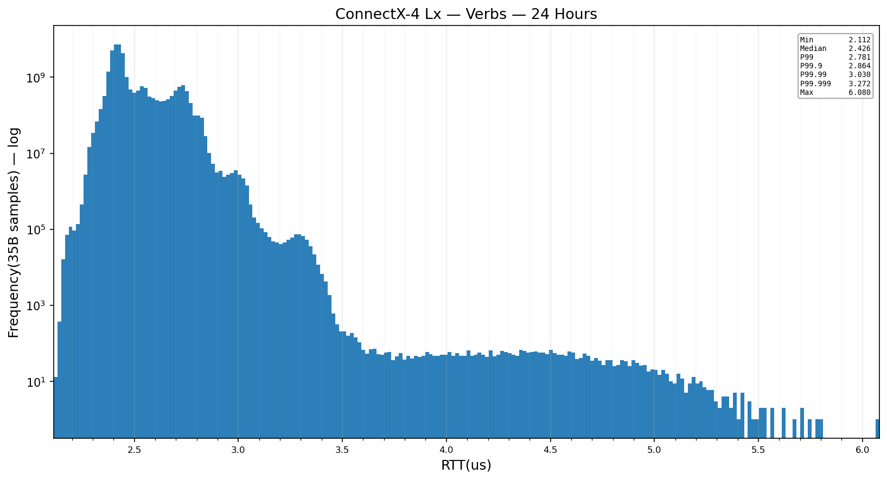
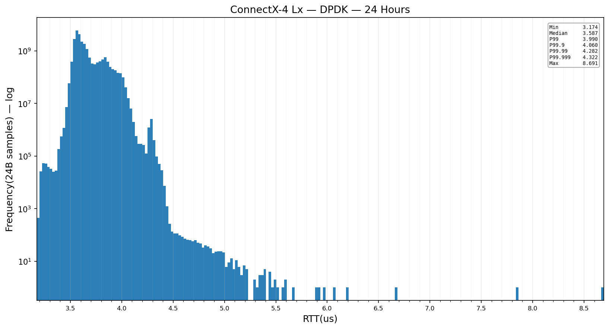
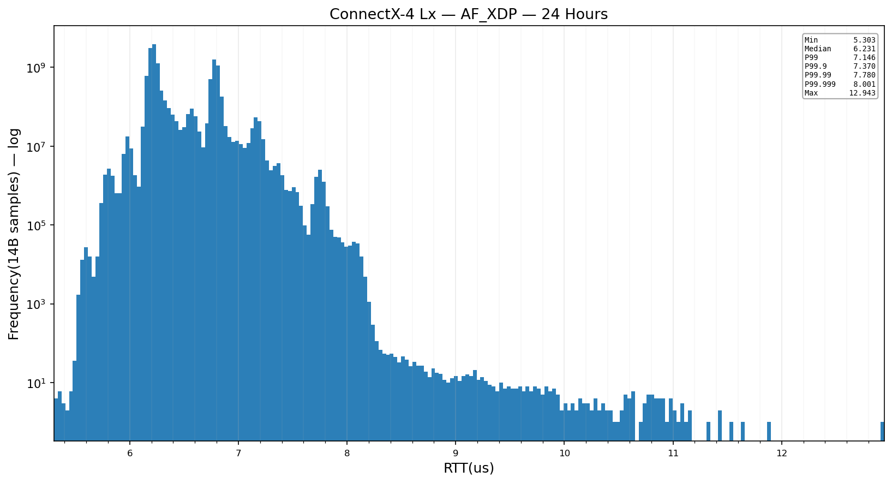
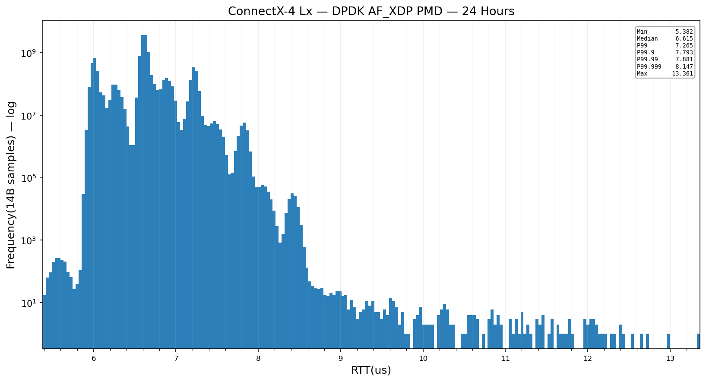
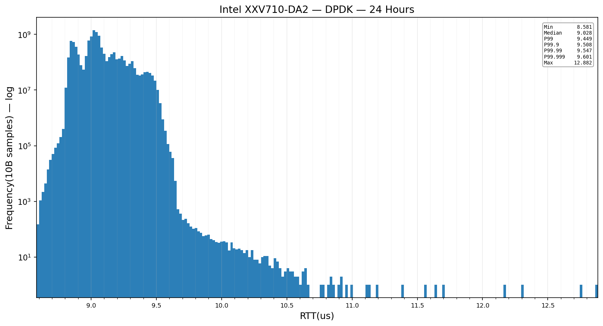
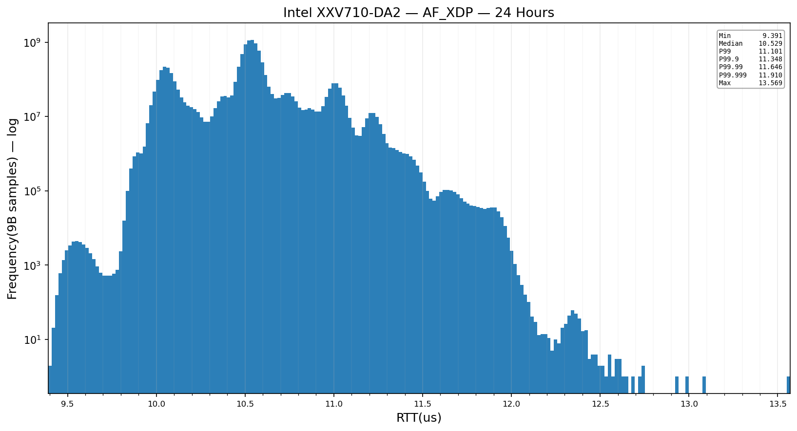
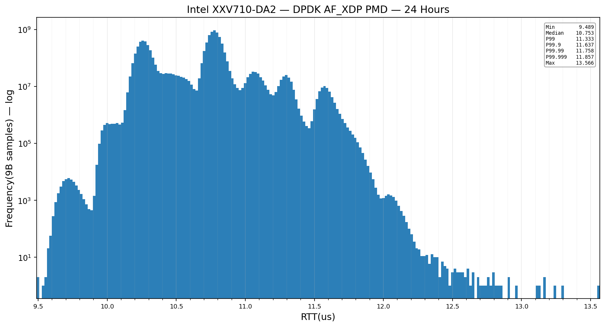
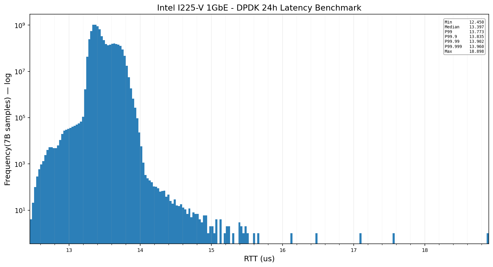
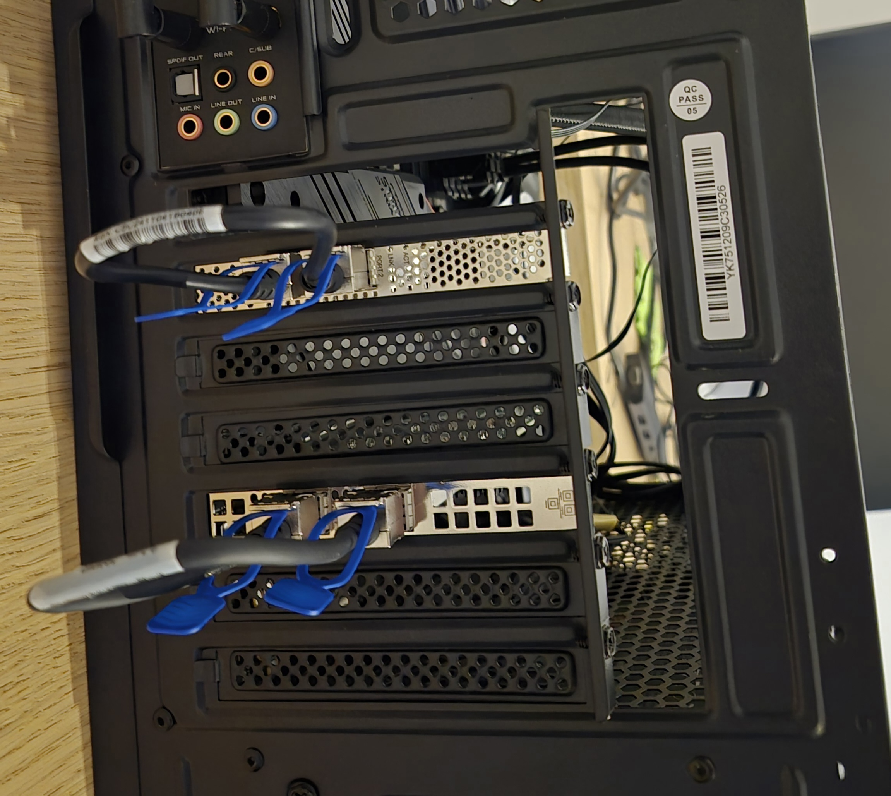
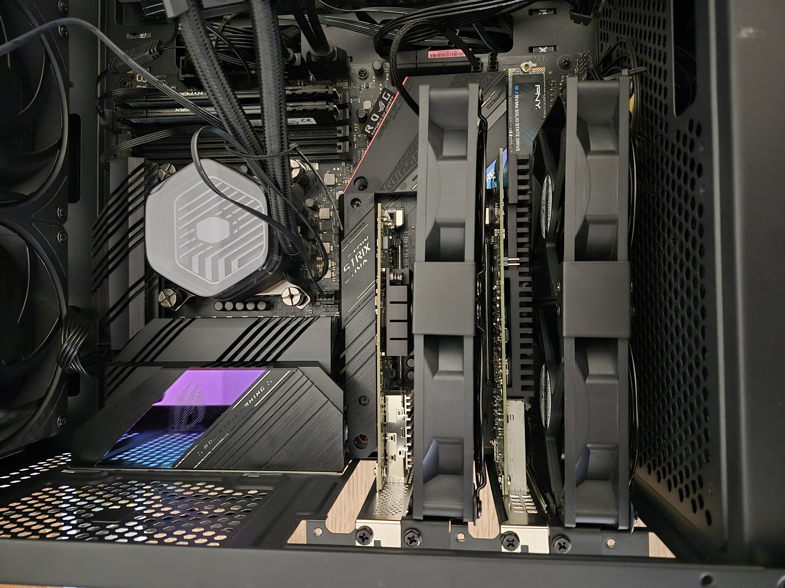

# Ultra-Low-Latency NIC Benchmarks — DPDK vs AF_XDP vs Verbs

Closed-loop round-trip latency on identical silicon across three NICs:
**ConnectX-4 Lx** (mlx5), **Intel XXV710-DA2** (i40e), and **Intel I225-V** (igc).
The goal is the comparison asked for constantly online and answered only with
theory: *DPDK vs AF_XDP (vs verbs) on the same NIC, with real tail percentiles.*

> **Status:** ConnectX-4 Lx (§3), Intel XXV710-DA2 (§4) and Intel I225-V (§5) are
> **complete** — all seven 24 h soaks populated (verbs, DPDK, AF_XDP and
> DPDK-over-AF_XDP on each 25 G NIC; DPDK on the I225-V). The I225-V is run at
> **1 GbE**, which beats the NIC's native 2.5 GbE for latency (the 2.5GBASE-T PHY
> paradox, §5.2); AF_XDP on igc is **disqualified by a driver defect** (§5.3). The
> Solarflare X2522 ef_vi comparison is still pending. Sections 1–2
> (system/config/methodology) are final.

**Contents**

- [Results at a glance](#results-at-a-glance--24-h-rtt-µs-one-frame-in-flight)
- [1. System](#1-system)
- [2. Configuration & Methodology](#2-configuration--methodology)
- [3. ConnectX-4 Lx (mlx5)](#3-connectx-4-lx-mlx5)
  - [3.1 Verbs & DPDK](#31-verbs--dpdk)
  - [3.2 AF_XDP — zero-copy + busy-poll](#32-af_xdp--zero-copy--busy-poll)
  - [3.3 DPDK over AF_XDP (AF_XDP PMD)](#33-dpdk-over-af_xdp-af_xdp-pmd)
- [4. Intel XXV710-DA2 (i40e)](#4-intel-xxv710-da2-i40e)
  - [4.1 DPDK — i40e PMD (vfio-pci)](#41-dpdk--i40e-pmd-vfio-pci)
  - [4.2 AF_XDP — zero-copy + busy-poll](#42-af_xdp--zero-copy--busy-poll)
  - [4.3 DPDK over AF_XDP (AF_XDP PMD)](#43-dpdk-over-af_xdp-af_xdp-pmd)
- [5. Intel I225-V (igc)](#5-intel-i225-v-igc)
  - [5.1 DPDK — igc PMD, link at 1 GbE](#51-dpdk--igc-pmd-vfio-pci-link-at-1-gbe)
  - [5.2 The 2.5G paradox](#52-the-25g-paradox--why-this-nic-is-benchmarked-at-1-gbe)
  - [5.3 AF_XDP — disqualified](#53-af_xdp--disqualified-the-driver-cannot-ping-pong)
- [Hardware photos](#hardware-photos)

### Results at a glance — 24 h RTT (µs), one frame in flight

| NIC | Transport | Median | P99.999 | Max | Samples |
|---|---|--:|---:|---:|---:|
| **ConnectX-4 Lx** (mlx5) | Verbs (RAW_PACKET QP) | **2.426** | 3.272 | 6.080 | 34.0 B |
| **ConnectX-4 Lx** (mlx5) | DPDK (mlx5 PMD) | **3.587** | 4.322 | 8.691 | 23.3 B |
| **ConnectX-4 Lx** (mlx5) | AF_XDP | **6.231** | 8.001 | 12.943 | 13.5 B |
| **ConnectX-4 Lx** (mlx5) | DPDK-over-AF_XDP PMD | **6.615** | 8.147 | 13.361 | 13.0 B |
| **Intel XXV710-DA2** (i40e) | DPDK (i40e PMD) | **9.028** | 9.601 | 12.882 | 9.47 B |
| **Intel XXV710-DA2** (i40e) | AF_XDP | **10.529** | 11.910 | 13.569 | 8.20 B |
| **Intel XXV710-DA2** (i40e) | DPDK-over-AF_XDP PMD | **10.753** | 11.857 | 13.566 | 8.05 B |
| **Intel I225-V** (igc) | DPDK (igc PMD), link at 1 GbE | **13.397** | 13.960 | 18.898 | 6.39 B |
| **Intel I225-V** (igc) | AF_XDP | \_disqualified — driver defect (§5.3)\_ | | | |

---

## 1. System

| Component | Specification                                                                    |
|---|----------------------------------------------------------------------------------|
| CPU | Intel Core i9-11900K Rocket Lake 8 cores                                         |
| RAM | 16 GB DDR4-3200                                                                  |
| Motherboard | ASUS ROG Strix Z590-E                                                            |
| Cooler | Cooler Master Atmos 360 mm AIO 300W TDP                                          |
| Disk | 256 GB NVMe M.2 SSD                                                              |
| OS | Ubuntu Server 26.04                                                              |
| Kernel | `7.0.7-hz100` — custom build, `CONFIG_HZ=100`, full `nohz_full`                  |
| TSC | 3.504 GHz, invariant (`tsc=reliable`) → **0.285 ns/tick** measurement resolution |

### NICs under test

| NIC | Driver | Ports | Link | Notes |
|---|---|---|---|---|
| Mellanox ConnectX-4 Lx | `mlx5_core` / `mlx5_ib` | cx0, cx1 | 2 × 25 GbE | RDMA-capable (verbs) |
| Intel XXV710-DA2 | `i40e` | xxv0, xxv1 | 2 × 25 GbE | DPDK via `vfio-pci` |
| Intel I225-V | `igc` | enp5s0, enp6s0 | 2 × 2.5GBASE-T (RJ45 copper) | Two single-port controllers, PCIe Gen2 ×1 each; DPDK via `vfio-pci`; benchmarked at **1 GbE** (§5.2) |

> **PCIe topology (Z590-E):** the two 25G add-in NICs run on the CPU PEG bifurcated
> **×8/×8** — ConnectX-4 Lx (×8) and XXV710-DA2 (×8), each at full bandwidth. The
> NVMe SSD sits on a **chipset (PCH) M.2** slot, off the CPU PEG, so it does not
> share the NICs' root complex (no cross-device PCIe contention).

### Hardware

> Photos of the loopback cabling and the NIC cooling are in
> **[Hardware photos](#hardware-photos)** at the end of this document.

---

## 2. Configuration & Methodology

### 2.1 BIOS
- ASUS Multi-Core Enhancement → **Enforce All Limits**
- Power limits: **PL1 = PL2 = 200 W**
- Core voltage: **−0.05 V offset undervolt** (thermal headroom)
- Core ratio: **all-core sync ×50 → 5.00 GHz pinned**
- **C-states disabled** and **SpeedStep (EIST) disabled** — fixed frequency, no idle transitions
- **All PCIe power-saving (ASPM / L-states) disabled**
- **AVX-512 disabled** (frequency/thermal stability — DPDK is built AVX2)
- Hyper-Threading (SMT): **disabled**
- **SATA controller disabled**, **legacy USB support disabled** (trim unused IRQ/SMI sources)

### 2.2 Kernel command line (`7.0.7-hz100`)
```
clocksource=tsc tsc=reliable nowatchdog nmi_watchdog=0 mce=ignore_ce pcie_aspm=off
isolcpus=domain,managed_irq,5-7 irqaffinity=0,1 rcu_nocbs=5-7 nohz_full=5-7 nosmt
cpufreq.default_governor=performance intel_idle.max_cstate=1 processor.max_cstate=1
intel_iommu=on iommu=pt default_hugepagesz=1G hugepagesz=1G hugepages=4
transparent_hugepage=never slub_debug=- module_blacklist=i915,xe
sysctl.vm.stat_interval=86400
```
- **Core isolation:** cores **5–7** isolated (`isolcpus` + `nohz_full` + `rcu_nocbs`);
  housekeeping on 0–4; device IRQs pinned to 0,1. RTT roles: client hot core 5,
  reflector hot core 6, histogram/recorder thread core 7.
- **iGPU disabled** (`module_blacklist=i915,xe`) — its vmap/vunmap churn triggered
  kernel-VA TLB-shootdown IPIs that reached the isolated cores.
- **`vm.stat_interval=86400`** — silences the periodic per-CPU vmstat kworker.
- 1 GiB hugepages, IOMMU passthrough, C-state 1, `performance` governor, no watchdog.

### 2.3 System tuning
- Hot path: one busy-poll thread per isolated core, **SCHED_OTHER** (measured
  statistically equal to SCHED_FIFO:49 on this rig — see §2.5).
- DPDK control/interrupt thread parked on housekeeping core 0 (off the poll cores).
- NIC completion IRQs kept off the poll cores where the queue count allows.

### 2.4 Measurement methodology
- **Loopback:** the two ports of each dual-port NIC are DAC-linked; one port is the
  client (originator), the other reflects every frame (MAC-swap echo).
- **Closed-loop RTT:** exactly one frame in flight — send → spin for the matching
  echo → record. One-way ≈ RTT / 2.
- **Timing:** `rdtscp` taken on a single pinned core (no cross-core skew); raw TSC
  cycle deltas, converted to µs once at report time.
- **Aggregation:** HdrHistogram, 5 significant figures over raw cycles →
  **~0.285 ns resolution** up to ~75 µs; O(1) memory, exact 64-bit counts.
- **Duration:** 24 h per transport; first 500k samples discarded as warm-up.
  Percentiles stabilise while the max ratchets — headline metric is **P99.999**.
- **Outputs:** `<name>.csv` (percentile) + `<name>.hist.csv` (per-bucket) under
  `test/latency_analysis/`, plotted with `plot_latency_hist.py`.

### 2.5 Notes on determinism (validated, not assumed)
- SCHED_OTHER vs SCHED_FIFO:49 — statistically tied on both NICs on a quiet box.
- The residual tail is the OS/observer, not the stack: the campaign's tightest
  distribution (XXV710 DPDK) holds **P99.999 within 0.57 µs of the median over
  9.5 B packets**, and the observer effect traced entirely to device IRQs landing on
  the isolated cores — steering WiFi/completion IRQs onto housekeeping cores 0–1 was
  what removed it (SSH-in + live `sensors` monitoring then had no measurable effect).
- On i40e the SCHED_FIFO busy-poll + NAPI-deferral strand is real but avoided by
  running SCHED_OTHER; see `Known_driver_issues.md` §1.2.

---

## 3. ConnectX-4 Lx (mlx5)

### 3.1 Verbs & DPDK

#### Verbs — RAW_PACKET QP, mlx5dv direct CQE poll

| Metric | RTT (µs) |
|---|---|
| Min | 2.112 |
| Median | 2.426 |
| P99 | 2.781 |
| P99.9 | 2.864 |
| P99.99 | 3.030 |
| P99.999 | 3.272 |
| Max | 6.080 |
| Mean | 2.460 |
| Samples | 34,024,754,354 |



#### DPDK — mlx5 PMD (bifurcated, kernel keeps the netdev)

| Metric | RTT (µs) |
|---|---|
| Min | 3.174 |
| Median | 3.587 |
| P99 | 3.990 |
| P99.9 | 4.060 |
| P99.99 | 4.282 |
| P99.999 | 4.322 |
| Max | 8.691 |
| Mean | 3.628 |
| Samples | 23,279,093,850 |



### 3.2 AF_XDP — zero-copy + busy-poll

> mlx5 is the one NIC where one-in-flight busy-poll achieves low latency (the CQE is
> written back promptly), so AF_XDP-ZC is viable here.

To compete with DPDK, AF_XDP must run **zero-copy** (frames DMA'd straight into the
user-space umem via the native driver — no kernel copy) and **busy-poll** (the app
drives the NAPI inline through the socket syscall, polling the rings instead of
waiting on interrupts). Both are **on by default** in our harness. Two tunables vary:

- **NAPI hard-IRQ deferral** — `napi_defer_hard_irqs` keeps the queue serviced by
  busy-poll for N rounds before re-arming the hardware IRQ; `gro_flush_timeout` is the
  backstop timer (ns) that re-arms the IRQ if the app stops polling. Together they let
  busy-poll suppress interrupts (lower jitter) — the regime the canonical AF_XDP
  README recommends:
  ```
  echo 2 | sudo tee /sys/class/net/<interface>/napi_defer_hard_irqs
  echo 200000 | sudo tee /sys/class/net/<interface>/gro_flush_timeout
  ```
  Reference: <https://github.com/xdp-project/bpf-examples/blob/main/AF_XDP-example/README.org>
- **`XDP_USE_NEED_WAKEUP`** — bind flag: when set, the app kicks the kernel
  (`sendto`/`poll`) only when the ring raises `need_wakeup`; when unset, the app
  always kicks, driving the NAPI inline every cycle.

#### Config sweep (5-min, to select the 24 h config)
All four keep zero-copy + busy-poll on; they vary `XDP_USE_NEED_WAKEUP` × deferral:

| Config | Min     | Median  | P99     | P99.9    | P99.99   | P99.999  | Max       |
|---|---------|---------|---------|----------|----------|----------|-----------|
| A — need_wakeup + deferral | _5.472_ | _6.298_ | _7.248_ | _7.550_  | _7.882_  | _8.031_  | _10.547_  |
| B — need_wakeup, no deferral | _6.231_ | _8.039_ | _9.779_ | _10.574_ | _10.862_ | _12.732_ | _181.301_ |
| C — no need_wakeup + deferral | _5.528_ | _6.232_ | _7.176_ | _7.520_  | _7.822_  | _8.009_  | _11.602_  |
| D — no need_wakeup, no deferral | _6.284_ | _7.944_ | _9.651_ | _10.465_ | _10.831_ | _15.101_ | _175.629_ |

_(all µs, RTT; 5-min runs.)_ **Chosen for 24 h: _Config C_.**

#### 24 h soak (Config C)

| Metric | RTT (µs) |
|---|---|
| Min | 5.303 |
| Median | 6.231 |
| P99 | 7.146 |
| P99.9 | 7.370 |
| P99.99 | 7.780 |
| P99.999 | 8.001 |
| Max | 12.943 |
| Mean | 6.389 |
| Samples | 13,460,287,612 |



### 3.3 DPDK over AF_XDP (AF_XDP PMD)

> DPDK's `net_af_xdp` vdev PMD — the DPDK API layered on top of the kernel AF_XDP
> socket (bifurcated, no vfio unbind). Answers "what does the general framework cost
> on top of raw AF_XDP?" Same Config C (zero-copy + busy-poll + deferral) as §3.2.

| Metric | RTT (µs) |
|---|---|
| Min | 5.382 |
| Median | 6.615 |
| P99 | 7.265 |
| P99.9 | 7.793 |
| P99.99 | 7.881 |
| P99.999 | 8.147 |
| Max | 13.361 |
| Mean | 6.592 |
| Samples | 13,027,086,306 |



---

## 4. Intel XXV710-DA2 (i40e)

### 4.1 DPDK — i40e PMD (vfio-pci)

> Sits at the i40e silicon floor (~9 µs RTT); application software is ~180 ns of the
> path, the rest is NIC + PCIe + 25G wire.

| Metric | RTT (µs) |
|---|---|
| Min | 8.581 |
| Median | 9.028 |
| P99 | 9.449 |
| P99.9 | 9.508 |
| P99.99 | 9.547 |
| P99.999 | 9.601 |
| Max | 12.882 |
| Mean | 9.038 |
| Samples | 9,472,423,727 |



### 4.2 AF_XDP — zero-copy + busy-poll

Same 4-config sweep as **§3.2** (zero-copy + busy-poll baseline; the deferral knobs
and `XDP_USE_NEED_WAKEUP` flag are defined there), run on `xxv0`/`xxv1`.

Getting AF_XDP to work on this NIC at all required clearing two i40e-specific driver
issues, both reproduced with the kernel's own `xdpsock` before trusting the diagnosis:

1. **Stock i40e silently disables busy-poll.** The driver never registers a NAPI id
   on its RX queues, so `SO_BUSY_POLL` becomes a no-op and every "busy-poll" run is
   secretly interrupt-driven. A one-line driver patch fixes it (igc and mlx5 work
   stock). See `Known_driver_issues.md` §1.1.
2. **A gapless SCHED_FIFO busy-poll can strand RX entirely.** With hard-IRQ deferral
   active on a truly clean isolated core, a FIFO-priority poll loop never yields the
   gap the driver needs to re-arm its interrupt — a single in-flight frame is then
   never delivered. All published runs use SCHED_OTHER, which avoids it. See
   `Known_driver_issues.md` §1.2.

#### Config sweep (5-min, to select the 24 h config)

| Config | Min     | Median   | P99      | P99.9    | P99.99   | P99.999   | Max       |
|---|---------|----------|----------|----------|----------|-----------|-----------|
| A — need_wakeup + deferral | _9.563_ | _10.480_ | _11.125_ | _11.391_ | _11.555_ | _11.702_  | _12.538_  |
| B — need_wakeup, no deferral | _9.357_ | _10.156_ | _10.766_ | _10.985_ | _11.164_ | _13.949_  | _202.22_  |
| C — no need_wakeup + deferral | _9.430_ | _10.517_ | _11.034_ | _11.208_ | _11.346_ | _11.498_  | _12.008_  |
| D — no need_wakeup, no deferral | _9.365_ | _10.103_ | _10.766_ | _11.012_ | _11.233_ | _101.938_ | _302.762_ |

_(all µs, RTT; 5-min runs.)_ **Chosen for 24 h: _Config C_.**

#### 24 h soak (Config C)

| Metric | RTT (µs) |
|---|---|
| Min | 9.391 |
| Median | 10.529 |
| P99 | 11.101 |
| P99.9 | 11.348 |
| P99.99 | 11.646 |
| P99.999 | 11.910 |
| Max | 13.569 |
| Mean | 10.502 |
| Samples | 8,203,692,200 |



### 4.3 DPDK over AF_XDP (AF_XDP PMD)

| Metric | RTT (µs) |
|---|---|
| Min | 9.489 |
| Median | 10.753 |
| P99 | 11.333 |
| P99.9 | 11.637 |
| P99.99 | 11.758 |
| P99.999 | 11.857 |
| Max | 13.566 |
| Mean | 10.641 |
| Samples | 8,053,389,198 |



---

## 5. Intel I225-V (igc)

The consumer outlier in the lineup: a gaming-motherboard-class 2.5GBASE-T copper NIC
(two single-port I225-V controllers, RJ45 Cat-cable loop, PCIe Gen2 ×1 each), driven by
the igc PMD over `vfio-pci`. It produced the two most surprising findings of the
campaign:

1. **It is *faster* at 1 GbE than at its native 2.5 GbE** — the 802.3bz 2.5GBASE-T PHY
   carries ~2.4 µs more *fixed* pipeline latency per wire traversal than plain
   1000BASE-T (§5.2).
2. **AF_XDP is disqualified outright** — the igc driver never services the XSK
   zero-copy TX ring from its own NAPI path, so a one-frame-in-flight RTT deadlocks
   after the first frame. Not slow: *unmeasurable* (§5.3).

### 5.1 DPDK — igc PMD (vfio-pci), link at 1 GbE

| Metric | RTT (µs) |
|---|---|
| Min | 12.450 |
| Median | 13.397 |
| P99 | 13.773 |
| P99.9 | 13.835 |
| P99.99 | 13.902 |
| P99.999 | 13.960 |
| Max | 18.898 |
| Mean | 13.434 |
| Samples | 6,390,422,581 |



_(Log-y — on a linear axis this distribution is so tight that the entire tail past
14 µs is invisible.)_

The tail is the story. **P99.999 lands 563 ns above the median**, over 6.39 billion round
trips with zero loss — statistically a dead heat with the XXV710's DPDK soak (573 ns) and,
in relative terms, the flattest distribution in the whole campaign (4.20 % of the median,
against 6.35 % for the XXV710 and 20.5 % for the ConnectX-4 Lx). The entire 24 h produced
one 18.898 µs outlier and nothing else above 17.6 µs.

That is the genuinely surprising result: a consumer gaming-motherboard controller is not
merely *usable* for deterministic work — its **jitter is indistinguishable from a 25 G
server NIC's**. What disqualifies the I225-V is the ~13 µs *offset*, not the spread, and
that offset is silicon (§5.2), not software. Determinism, it turns out, is far cheaper to
buy than latency.

Register-level tuning contributed almost nothing here. A full audit of the igc PMD
(`Known_driver_issues.md` §2.4) found the link speed to be the **only** lever that
exists: interrupt moderation is already off after reset, EEE/LPI is already disabled by
the PMD's base init (and the i225 has no 802.3az anyway — that is i226), DMA coalescing
is never enabled, and the PMD exposes no devargs at all. The one knob that looks like a
free win — RX `WTHRESH = 0` for immediate descriptor write-back — instead stops
write-back dead, silently dropping every frame while `imissed` reports zero
(§3.2 of the same document).

### 5.2 The 2.5G paradox — why this NIC is benchmarked at 1 GbE

The I225-V is **slower at its native 2.5 GbE than at 1 GbE**. Same box, same build, same
one-frame-in-flight loop — the only change is the autoneg advertisement:

#### 2.5 GbE — DPDK, igc PMD (5-minute run)

| Metric | RTT (µs) |
|---|---|
| Min | 16.362 |
| Median | 17.143 |
| P99 | 17.657 |
| P99.9 | 17.725 |
| P99.99 | 17.759 |
| P99.999 | 17.788 |
| Max | 22.866 |
| Mean | 17.171 |
| Samples | 16,714,295 |

_(Both ports' copper autoneg outlasted the PMD's ~20 s link-wait, and 3 frames of 17.2 M
were lost in that window — all inside the discarded 500 k-sample warm-up. Zero timeouts and
zero loss thereafter.)_

Against the 1 GbE results in §5.1, dropping the link speed is worth **3.75 µs of median
RTT** (17.143 → 13.397) — the *slower* link is 22 % faster end to end. That is not a
tuning artefact and not noise: the 1 GbE figure was reproduced over a 24 h soak of 6.39
billion samples, and the 2.5 G distribution here is itself tight (P99.999 sits 645 ns
above the median), so the two populations do not come close to overlapping. The penalty
is a clean, fixed offset — exactly the signature of a pipeline cost rather than a
scheduling or contention effect.

The mechanism is the PHY, and Intel documents it in its own driver. The igc PTP
timestamp-correction constants (`igc.h`, applied per link speed in `igc_ptp.c`) record the
i225's *fixed* MAC+PHY pipeline latency: at 2500 Mbit/s it is **1325 ns TX + 1485 ns RX =
2.81 µs per wire traversal**, against **80 ns TX + 300 ns RX = 0.38 µs** at 1000 Mbit/s.
An RTT crosses the wire twice, so 2.5GBASE-T carries ~5.6 µs of unavoidable PHY latency
where 1000BASE-T carries ~0.76 µs — a ~4.9 µs structural penalty, against which 1 GbE's
slower serialisation of a 64-byte frame costs only ~0.7 µs. The faster link loses. That
model predicts a ~4.2 µs net win for 1 GbE and we measured 3.75 µs, so Intel's published
constants are, if anything, slightly pessimistic — but they identify the mechanism, and
nothing else in the stack moves a number of this size.

This is inherent to 802.3bz, not to Intel: 2.5GBASE-T is a quarter-clocked 10GBASE-T, so
the LDPC codeword that occupies 320 ns at 10 G takes 1.28 µs to fill at 2.5 G and must be
buffered whole before it can be decoded — which is almost exactly the 1485 ns RX constant
above. The IEEE task force's own delay budget (802.3bz D2.0, Table 125-5) permits up to
25 pause-quanta ≈ 5.12 µs of TX+RX PHY delay; the i225's 2.81 µs sits at ~55 % of that
ceiling, i.e. it is a *sane* implementation of an inherently high-latency line code. No
register setting reaches it. **The only lever is to not use it.**

### 5.3 AF_XDP — disqualified: the driver cannot ping-pong

igc never services the XSK zero-copy TX ring from its own NAPI path: `sendto` kicks
are no-ops, and frames only leave when unrelated kernel traffic happens to run the TX
queue's NAPI. A one-frame-in-flight RTT therefore deadlocks after the first hop — the
kernel's own `xdpsock -l` freezes at rx=1/tx=1 on igc, while the identical procedure
bounces >1 M hops on i40e and mlx5. Not slow: *unmeasurable*. This also rules out the
DPDK-over-AF_XDP PMD here (it rides the same `igc.ko` zero-copy path). Full mechanism and
the 3-NIC xdpsock proof: `Known_driver_issues.md` §2.1.

---

## Hardware photos


*Both 25 G NICs — ConnectX-4 Lx and Intel XXV710-DA2 — DAC-looped port 0 ↔ port 1
(blue pull-tab DAC cables). Each frame the client port sends is reflected by the
card's second port, giving the exactly-one-frame-in-flight closed loop.*


*Add-in 12 V fans over the passively-cooled NIC heatsinks. Forced airflow dropped the
ConnectX-4 Lx from 80 °C+ to under 50 °C and keeps the Solarflare X2522 inside its
thermal envelope for sustained 24 h soaks — the cards ship with no fan of their own.*
