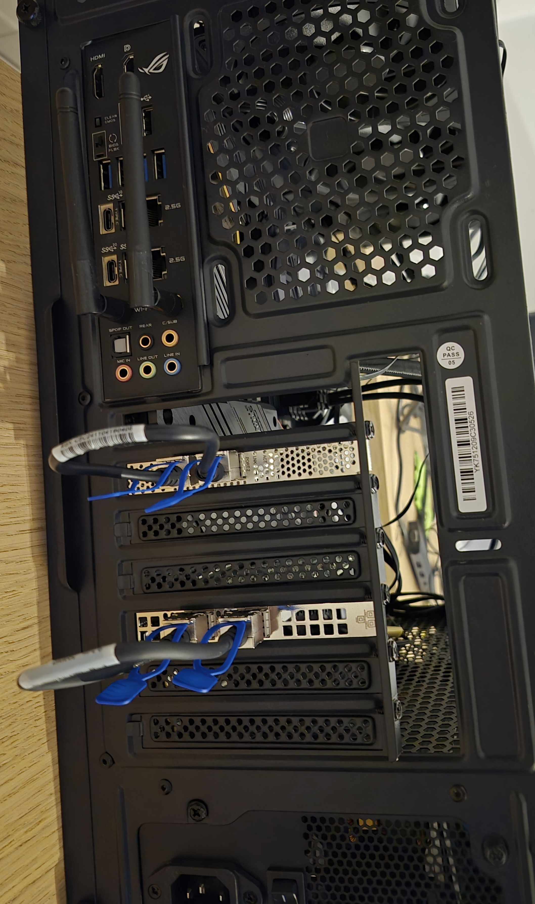
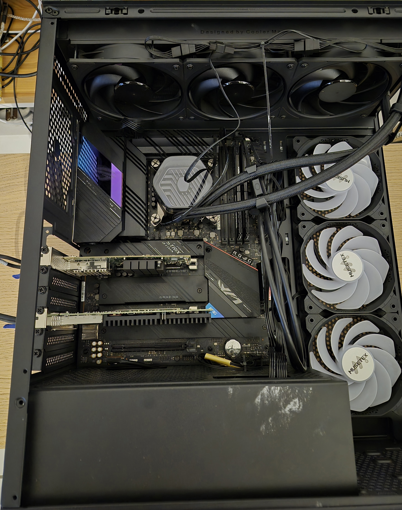

# Ultra-Low-Latency NIC Benchmarks — DPDK vs AF_XDP vs Verbs

Closed-loop round-trip latency on identical silicon across three NICs:
**ConnectX-4 Lx** (mlx5), **Intel XXV710-DA2** (i40e), and **Intel I225-V** (igc).
The goal is the comparison asked for constantly online and answered only with
theory: *DPDK vs AF_XDP (vs verbs) on the same NIC, with real tail percentiles.*

> **Status:** skeleton. Sections 1–2 (system/config/methodology) are final;
> the per-transport result tables in §3–§5 are placeholders to be filled from the
> 24 h soaks.

---

## 1. System

| Component | Specification |
|---|---|
| CPU | Intel Core i9-11900K (Rocket Lake, 8C/16T) — **SMT disabled → 8 active cores** |
| RAM | 16 GB DDR4-3200 _(channel config: TBD)_ |
| Motherboard | ASUS ROG Strix Z590-E Gaming WiFi (BIOS 2405) |
| Cooler | Cooler Master Atmos 360 mm AIO (≈300 W) |
| Disk | 128 GB NVMe M.2 SSD |
| OS | Ubuntu 26.04 |
| Kernel | `7.0.7-hz100` — custom build, `CONFIG_HZ=100`, full `nohz_full` |
| TSC | 3.504 GHz, invariant (`tsc=reliable`) → **0.285 ns/tick** measurement resolution |

### NICs under test

| NIC | Driver | Ports | Link | Notes |
|---|---|---|---|---|
| Mellanox ConnectX-4 Lx | `mlx5_core` / `mlx5_ib` | cx0, cx1 | 2 × 25 GbE | RDMA-capable (verbs) |
| Intel XXV710-DA2 | `i40e` | xxv0, xxv1 | 2 × 25 GbE | DPDK via `vfio-pci` |
| Intel I225-V | `igc` | enp6s0, enp7s0 | 2.5 GbE | DPDK via `vfio-pci` |

> **PCIe topology (Z590-E):** the two 25G add-in NICs run on the CPU PEG bifurcated
> **×8/×8** — ConnectX-4 Lx (×8) and XXV710-DA2 (×8), each at full bandwidth. The
> NVMe SSD sits on a **chipset (PCH) M.2** slot, off the CPU PEG, so it does not
> share the NICs' root complex (no cross-device PCIe contention).

### Hardware


*Dual-port NICs DAC-looped — client port ↔ reflector (echo) port.*


*ASUS ROG Strix Z590-E with the 25G NICs installed.*

---

## 2. Configuration & Methodology

### 2.1 BIOS
- ASUS Multi-Core Enhancement → **Enforce All Limits**
- Power limits: **PL1 = PL2 = 200 W**
- Core voltage: **−0.05 V offset undervolt** (thermal headroom)
- Core ratio: **all-core sync ×50 → 5.00 GHz pinned**
- **C-states disabled** and **SpeedStep (EIST) disabled** — fixed frequency, no idle transitions
- **All PCIe power-saving (ASPM / L-states) disabled**
- **AVX-512 disabled** (frequency/thermal stability — DPDK is built AVX2)
- Hyper-Threading (SMT): **disabled**
- **SATA controller disabled**, **legacy USB support disabled** (trim unused IRQ/SMI sources)

### 2.2 Kernel command line (`7.0.7-hz100`)
```
clocksource=tsc tsc=reliable nowatchdog nmi_watchdog=0 mce=ignore_ce pcie_aspm=off
isolcpus=domain,managed_irq,2-4 irqaffinity=0,1 rcu_nocbs=2-4 nohz_full=2-4 nosmt
cpufreq.default_governor=performance intel_idle.max_cstate=1 processor.max_cstate=1
intel_iommu=on iommu=pt default_hugepagesz=1G hugepagesz=1G hugepages=4
transparent_hugepage=never slub_debug=- module_blacklist=i915,xe
sysctl.vm.stat_interval=86400
```
- **Core isolation:** cores **2–4** isolated (`isolcpus` + `nohz_full` + `rcu_nocbs`);
  housekeeping on 0,1,5,6,7; device IRQs pinned to 0,1.
- **iGPU disabled** (`module_blacklist=i915,xe`) — its vmap/vunmap churn triggered
  kernel-VA TLB-shootdown IPIs that reached the isolated cores.
- **`vm.stat_interval=86400`** — silences the periodic per-CPU vmstat kworker.
- 1 GiB hugepages, IOMMU passthrough, C-state 1, `performance` governor, no watchdog.

### 2.3 System tuning
- Hot path: one busy-poll thread per isolated core, **SCHED_OTHER** (measured
  statistically equal to SCHED_FIFO:49 on this rig — see §2.5).
- DPDK control/interrupt thread parked on housekeeping core 0 (off the poll cores).
- NIC completion IRQs kept off the poll cores where the queue count allows.

### 2.4 Measurement methodology
- **Loopback:** the two ports of each dual-port NIC are DAC-linked; one port is the
  client (originator), the other reflects every frame (MAC-swap echo).
- **Closed-loop RTT:** exactly one frame in flight — send → spin for the matching
  echo → record. One-way ≈ RTT / 2.
- **Timing:** `rdtscp` taken on a single pinned core (no cross-core skew); raw TSC
  cycle deltas, converted to µs once at report time.
- **Aggregation:** HdrHistogram, 5 significant figures over raw cycles →
  **~0.285 ns resolution** up to ~75 µs; O(1) memory, exact 64-bit counts.
- **Duration:** 24 h per transport; first 500k samples discarded as warm-up.
  Percentiles stabilise while the max ratchets — headline metric is **P99.999**.
- **Outputs:** `<name>.csv` (percentile) + `<name>.hist.csv` (per-bucket) under
  `test/latency_analysis/`, plotted with `plot_latency_hist.py`.

### 2.5 Notes on determinism (validated, not assumed)
- SCHED_OTHER vs SCHED_FIFO:49 — statistically tied on both NICs on a quiet box.
- The residual tail on a quiet box is the OS/observer, not the stack (osnoise = 0
  noise on the isolated cores). _Expand with the campaign findings._

---

## 3. ConnectX-4 Lx (mlx5)

### 3.1 Verbs & DPDK

#### Verbs — RAW_PACKET QP, mlx5dv direct CQE poll
_[24 h soak pending]_

| Metric | One-way (µs) |
|---|---|
| Min | _TBD_ |
| Median | _TBD_ |
| P99 | _TBD_ |
| P99.9 | _TBD_ |
| P99.99 | _TBD_ |
| P99.999 | _TBD_ |
| Max | _TBD_ |
| Mean | _TBD_ |
| Samples | _TBD_ |


#### DPDK — mlx5 PMD (bifurcated, kernel keeps the netdev)
_[24 h soak pending]_

| Metric | One-way (µs) |
|---|---|
| Min | _TBD_ |
| Median | _TBD_ |
| P99 | _TBD_ |
| P99.9 | _TBD_ |
| P99.99 | _TBD_ |
| P99.999 | _TBD_ |
| Max | _TBD_ |
| Mean | _TBD_ |
| Samples | _TBD_ |


### 3.2 AF_XDP — zero-copy + busy-poll

> mlx5 is the one NIC where one-in-flight busy-poll achieves low latency (the CQE is
> written back promptly), so AF_XDP-ZC is viable here.

To compete with DPDK, AF_XDP must run **zero-copy** (frames DMA'd straight into the
user-space umem via the native driver — no kernel copy) and **busy-poll** (the app
drives the NAPI inline through the socket syscall, polling the rings instead of
waiting on interrupts). Both are **on by default** in our harness. Two tunables vary:

- **NAPI hard-IRQ deferral** — `napi_defer_hard_irqs` keeps the queue serviced by
  busy-poll for N rounds before re-arming the hardware IRQ; `gro_flush_timeout` is the
  backstop timer (ns) that re-arms the IRQ if the app stops polling. Together they let
  busy-poll suppress interrupts (lower jitter) — the regime the canonical AF_XDP
  README recommends:
  ```
  echo 2 | sudo tee /sys/class/net/<interface>/napi_defer_hard_irqs
  echo 200000 | sudo tee /sys/class/net/<interface>/gro_flush_timeout
  ```
  Reference: <https://github.com/xdp-project/bpf-examples/blob/main/AF_XDP-example/README.org>
- **`XDP_USE_NEED_WAKEUP`** — bind flag: when set, the app kicks the kernel
  (`sendto`/`poll`) only when the ring raises `need_wakeup`; when unset, the app
  always kicks, driving the NAPI inline every cycle.

#### Config sweep (5-min, to select the 24 h config)
All four keep zero-copy + busy-poll on; they vary `XDP_USE_NEED_WAKEUP` × deferral:

| Config | Min     | Median  | P99     | P99.9   | P99.99   | P99.999  | Max       |
|---|---------|---------|---------|---------|----------|----------|-----------|
| A — need_wakeup + deferral | _5.570_ | _6.294_ | _7.185_ | _7.353_ | _7.558_  | _7.689_  | _30.501_  |
| B — need_wakeup, no deferral | _6.094_ | _7.726_ | _9.341_ | _9.699_ | _10.661_ | _15.527_ | _353.468_ |
| C — no need_wakeup + deferral | _5.518_ | _6.237_ | _7.177_ | _7.535_ | _7.808_  | _8.026_  | _39.183_  |
| D — no need_wakeup, no deferral | _5.966_ | _7.716_ | _9.220_ | _9.781_ | _10.560_ | _14.546_ | _345.356_ |

_(all µs, one-way; 5-min runs.)_ **Chosen for 24 h: _Config A due to measurably better tail latency_.**

#### 24 h soak (chosen config)
_[pending the sweep above]_

| Metric | One-way (µs) |
|---|---|
| Min | _TBD_ |
| Median | _TBD_ |
| P99 | _TBD_ |
| P99.9 | _TBD_ |
| P99.99 | _TBD_ |
| P99.999 | _TBD_ |
| Max | _TBD_ |
| Mean | _TBD_ |
| Samples | _TBD_ |


---

## 4. Intel XXV710-DA2 (i40e)

### 4.1 DPDK — i40e PMD (vfio-pci)
_[24 h soak pending]_

> Sits at the i40e silicon floor (~9 µs RTT); application software is ~180 ns of the
> path, the rest is NIC + PCIe + 25G wire.

| Metric | One-way (µs) |
|---|---|
| Min | _TBD_ |
| Median | _TBD_ |
| P99 | _TBD_ |
| P99.9 | _TBD_ |
| P99.99 | _TBD_ |
| P99.999 | _TBD_ |
| Max | _TBD_ |
| Mean | _TBD_ |
| Samples | _TBD_ |


### 4.2 AF_XDP — zero-copy + busy-poll

> On kernel 7.0, i40e one-in-flight busy-poll does **not** engage (RX descriptor
> write-back is IRQ-gated) — AF_XDP runs interrupt-driven here. _Document the
> stock-vs-patched finding._

Same 4-config sweep as **§3.2** (zero-copy + busy-poll baseline; the deferral knobs
and `XDP_USE_NEED_WAKEUP` flag are defined there), run on `xxv0`/`xxv1`.

#### Config sweep (5-min, to select the 24 h config)

| Config | Min | Median | P99 | P99.9 | P99.99 | P99.999 | Max |
|---|---|---|---|---|---|---|---|
| A — need_wakeup + deferral | _TBD_ | _TBD_ | _TBD_ | _TBD_ | _TBD_ | _TBD_ | _TBD_ |
| B — need_wakeup, no deferral | _TBD_ | _TBD_ | _TBD_ | _TBD_ | _TBD_ | _TBD_ | _TBD_ |
| C — no need_wakeup + deferral | _TBD_ | _TBD_ | _TBD_ | _TBD_ | _TBD_ | _TBD_ | _TBD_ |
| D — no need_wakeup, no deferral | _TBD_ | _TBD_ | _TBD_ | _TBD_ | _TBD_ | _TBD_ | _TBD_ |

_(all µs, one-way; 5-min runs.)_ **Chosen for 24 h: _TBD_.**

#### 24 h soak (chosen config)
_[pending the sweep above]_

| Metric | One-way (µs) |
|---|---|
| Min | _TBD_ |
| Median | _TBD_ |
| P99 | _TBD_ |
| P99.9 | _TBD_ |
| P99.99 | _TBD_ |
| P99.999 | _TBD_ |
| Max | _TBD_ |
| Mean | _TBD_ |
| Samples | _TBD_ |


---

## 5. Intel I225-V (igc)

### 5.1 DPDK — igc PMD (vfio-pci)
_[24 h soak pending]_

| Metric | One-way (µs) |
|---|---|
| Min | _TBD_ |
| Median | _TBD_ |
| P99 | _TBD_ |
| P99.9 | _TBD_ |
| P99.99 | _TBD_ |
| P99.999 | _TBD_ |
| Max | _TBD_ |
| Mean | _TBD_ |
| Samples | _TBD_ |


### 5.2 AF_XDP — zero-copy + busy-poll
_[24 h soak pending]_

> igc busy-poll works for throughput but stalls the one-in-flight RTT (Intel-wide
> RX write-back starvation, same class as i40e). _Confirm latency-mode behaviour._

| Metric | One-way (µs) |
|---|---|
| Min | _TBD_ |
| Median | _TBD_ |
| P99 | _TBD_ |
| P99.9 | _TBD_ |
| P99.99 | _TBD_ |
| P99.999 | _TBD_ |
| Max | _TBD_ |
| Mean | _TBD_ |
| Samples | _TBD_ |


---

## Appendix — reproduction

- Toolchain / build: `diagnostic_scripts/build.sh` (x86_64 Release).
- Run: `diagnostic_scripts/rtt_run.sh <config.toml>` per NIC/transport.
- Plot: `python3 test/latency_analysis/plot_latency_hist.py <name>.hist.csv --title "..."`.
- Raw data: `test/latency_analysis/*.csv` (+ `*.hist.csv`).
